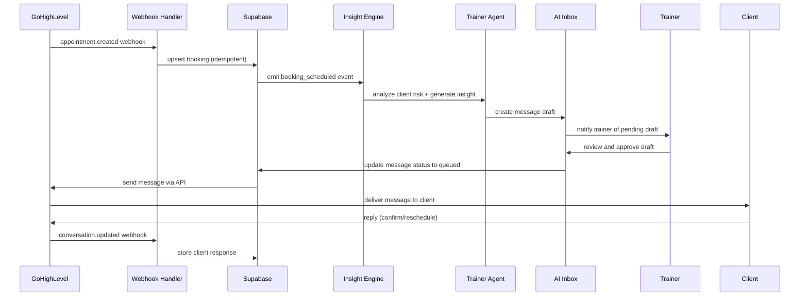
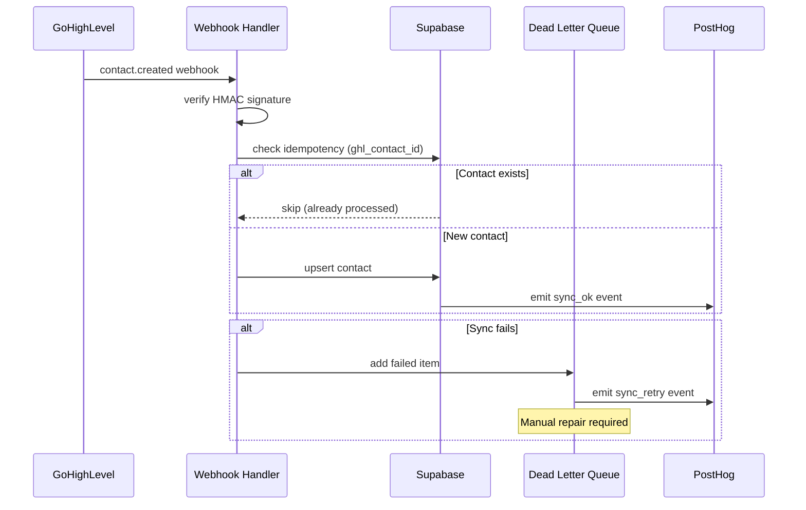

# TrainU Architecture

## System Boundaries

**GoHighLevel (GHL) - Operational Source of Truth:**
- Leads, appointments, conversations, offers/payments
- Booking calendar and scheduling
- CRM and pipeline management

**Supabase - Product Data & AI Platform:**
- User profiles, programs, sessions, goals
- AI agent telemetry and message drafts
- Authentication and authorization (RBAC)
- File storage and embeddings

## Application Architecture

### Apps

**`apps/web` - Next.js Application**
- **Framework:** Next.js 14+ with App Router and React Server Components (RSC)
- **Authentication:** Supabase Auth with role-based routing
- **API Routes:** Webhook handlers, reconciliation endpoints, health checks
- **UI:** Tailwind CSS with shared component library (`packages/ui`)

**`apps/agent` - LangGraph Worker**
- **Purpose:** PocketFlow ticket automation with deterministic steps
- **Framework:** LangGraph for agent orchestration
- **Logging:** Structured logs to `agent_events` table
- **Integration:** OpenAI for LLM calls, Supabase for data access

### Data Flow

**Booking Flow:**
```
GHL Booking → Webhook → webhook_events → upsert booking → PostHog event
```

**AI Agent Flow:**
```
Event → Insight Engine → Message Draft → AI Inbox → Trainer Approval → Send
```

**Sync Architecture:**
```
GHL Webhook → Idempotent Handler → Upsert → DLQ (if failed) → Manual Repair
```

## Sequence Diagrams

### Booking Scheduled to Message Sent Flow



### GHL Contact Sync Flow



## Technology Stack

### Frontend
- **Next.js 14+** with App Router
- **React Server Components** for server-side rendering
- **Tailwind CSS** for styling
- **PostHog** for analytics and feature flags
- **Sentry** for error tracking

### Backend
- **Supabase** for database, auth, and storage
- **OpenAI API** for LLM capabilities
- **GoHighLevel API** for CRM integration
- **Stripe** for payments (future)

### Infrastructure
- **Vercel** for hosting (Next.js)
- **Supabase** for managed PostgreSQL
- **PostHog** for analytics infrastructure
- **Sentry** for error monitoring

## Data Model

### Core Tables

**Authentication & Users**
- `users` - Supabase auth with roles (owner, trainer, client)
- `trainers` - Trainer profiles and preferences
- `clients` - Client profiles linked to trainers

**Bookings & Scheduling**
- `bookings` - Appointments synced from GHL
- `contacts` - GHL contacts (non-app users)

**AI & Messaging**
- `messages` - Thread-based messaging with approval workflow
- `insights` - AI-generated suggestions and risk scores
- `agent_events` - Structured logging for agent operations

**Goals & Progress**
- `goals` - Client goal definitions
- `goal_entries` - Progress tracking entries
- `v_goal_progress` - Computed progress view

**System & Sync**
- `webhook_events` - Idempotent webhook processing
- `sync_queue` - Dead letter queue for failed syncs
- `events` - Immutable event log

## Security Model

### Authentication
- **Supabase Auth** with email/password and social providers
- **Role-based access control** (RBAC) with three roles:
  - `owner` - Full system access
  - `trainer` - Trainer dashboard and client management
  - `client` - Personal dashboard and goal tracking

### Data Protection
- **Row Level Security (RLS)** enabled on all user-facing tables
- **API key rotation** for external service integrations
- **PII redaction** in logs and analytics
- **Encrypted storage** for sensitive data (Supabase default)

### Network Security
- **CORS** restricted to production domains
- **Webhook signature verification** for GHL integration
- **Rate limiting** on API endpoints
- **HTTPS only** in production

## Integration Patterns

### GHL Integration
- **Webhook-first** architecture with REST fallbacks
- **Idempotent processing** using external IDs
- **Exponential backoff** for retries
- **Dead letter queue** for manual intervention

### AI Agent Integration
- **Human-in-the-loop** approval for all outbound messages
- **Structured prompts** with safety constraints
- **Rate limiting** and quiet hours enforcement
- **Escalation rules** for sensitive topics

## Monitoring & Observability

### Metrics
- **PostHog** for user behavior and conversion tracking
- **Sentry** for error monitoring and performance
- **Custom dashboards** for business metrics (show-rate, sync health)

### Logging
- **Structured logs** with correlation IDs
- **Agent telemetry** for AI operations
- **Audit trails** for all user actions

### Alerting
- **SEV1:** Data loss or mass send errors
- **SEV2:** Sync failures or performance degradation
- **SEV3:** UI bugs and non-blocking issues

## Deployment

### Environments
- **Development:** Local with Supabase cloud
- **Staging:** Vercel preview deployments
- **Production:** Vercel production with custom domain

### CI/CD
- **GitHub Actions** for automated testing
- **Type checking** and linting on all PRs
- **Database migrations** via Supabase CLI
- **Feature flags** via PostHog for gradual rollouts

## Later Phases

### Phase 3: Custom App Hardening
- **Durable job queues** for background processing
- **Advanced analytics** and reporting
- **Multi-tenant isolation** improvements
- **Program template system**

### Phase 4: Motion + Mobile
- **MediaPipe integration** for pose analysis
- **React Native** mobile application
- **Wearable device** integrations
- **Advanced motion tracking** capabilities

## Related Documents

- [Data Model](docs/Context/DATA_MODEL.md) - Detailed database schema
- [GHL Integration](docs/Context/INTEGRATIONS_GHL_SYNC.md) - Sync specifications
- [API Contracts](API_CONTRACTS.md) - API endpoints and webhook specifications
- [Error Handling](ERRORS.md) - Error handling patterns and idempotency
- [Observability](docs/Observability.md) - Monitoring and alerting strategy
- [Security & Privacy](docs/Context/SECURITY_PRIVACY.md) - Data protection policies